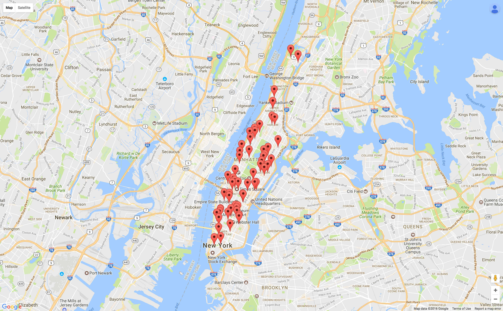
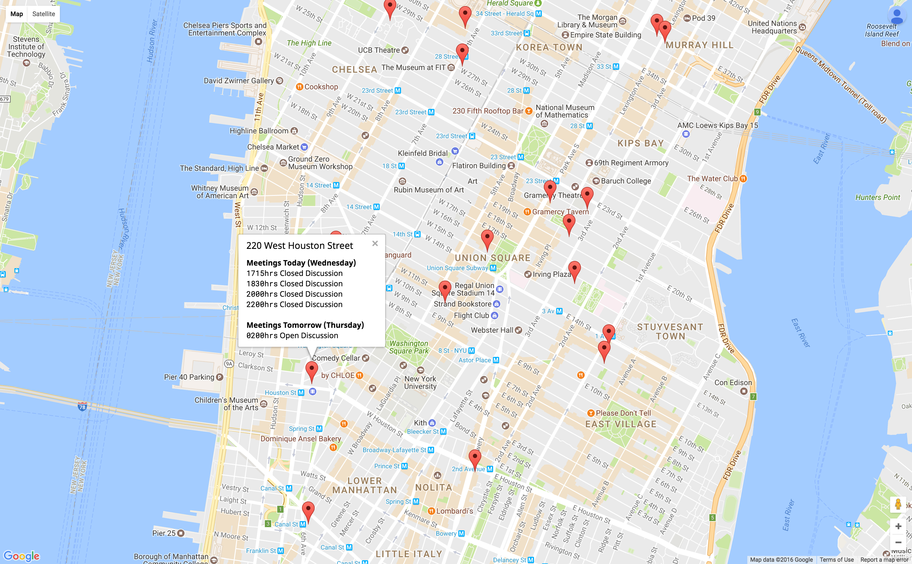

# Final Assignment 1





Mongo Structure
```
collection.insert({
    address: meetings_data[i].address,
    latLong: meetings_data[i].latLong,          
    days: meetings_data[i].days,
    start: meetings_data[i].start,
    end: meetings_data[i].end,
    type: meetings_data[i].type,
    interest: meetings_data[i].interest
});
```

Query Result Sample
```
[
	{
		"_id":
		{
			"latLong": 
			{	
				"lat":40.7123651,
				"lng":-74.00956409999999
			}
		},
		"groups":
		[
			{
				"info":
				{
					"latLong":
					{
						"lat":40.7123651,
						"lng":-74.00956409999999
					},
					"address":"22 Barclay Street, New York, NY"
				},
				"days":["3","3"],
				"start":[2000,2000],
				"type":["OD","OD"]
			}
		]
	},

	{
		"_id":
		{
			"latLong":
			{
				"lat":40.7081354,
				"lng":-74.00394519999999
			}
		},
		"groups":
		[
			{
				"info":
				{	
					"latLong":
					{
						"lat":40.7081354,
						"lng":-74.00394519999999
					},
					"address":"49 Fulton Street, New York, NY"
				},
				"days":["3","3"],"start":[1215,1215],"type":["BB","BB"]
			}
		]
	}
]


```

